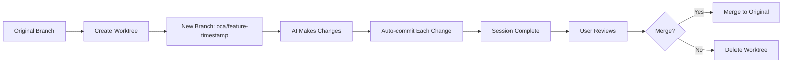

# Ollama Code Assistant (OCA)

A free and open-source command-line interface tool for AI-assisted coding using Ollama's open-weight language models. OCA provides a safe, isolated environment for AI-driven code modifications with comprehensive Git integration and strict sandboxing.

## Table of Contents

- [Features](#features)
- [Key Differences from Similar Tools](#key-differences-from-similar-tools)
- [Installation](#installation)
- [Quick Start](#quick-start)
- [Architecture](#architecture)
- [Configuration](#configuration)
- [Usage](#usage)
- [Development](#development)
- [Testing](#testing)
- [Security & Safety](#security--safety)
- [Contributing](#contributing)
- [License](#license)

## Features

### Core Capabilities
- **AI-Powered Code Assistance**: Leverage Ollama's open-weight LLMs for code understanding, generation, and modification
- **Pure CLI Interface**: Fast, scriptable command-line interface (no TUI/REPL)
- **Automatic Git Isolation**: Every session creates a new Git worktree and branch
- **Comprehensive Audit Trail**: Every AI action is committed with detailed messages
- **Safe by Design**: Strictly sandboxed to current working directory
- **100% Test Coverage**: Fully mocked Ollama interactions for reliable testing

### Key Functionality
- Code analysis and explanation
- Bug fixing and refactoring
- Test generation
- Documentation creation
- Git operations (commits, branches)
- Multi-file edits with context awareness
- Code search and navigation
- Security vulnerability detection

## Key Differences from Similar Tools

| Feature | OCA | Claude Code |
|---------|-----|-------------|
| LLM Backend | Ollama (local, open-weight) | Anthropic API (cloud) |
| Interface | Pure CLI | TUI/REPL |
| Language | Python | Node.js |
| Git Strategy | Always new worktree/branch | Works in current branch |
| Privacy | 100% local | Cloud-based |
| Cost | Free | Subscription required |

## Installation

### Prerequisites
- Python 3.8+
- Git 2.20+ (with worktree support)
- Ollama installed and running
- At least one Ollama model pulled (e.g., `ollama pull codellama`)

### Install via pip
```bash
pip install ollama-code-assistant
```

### Install from source
```bash
git clone https://github.com/yourusername/ollama-code-assistant.git
cd ollama-code-assistant
pip install -e .
```

## Quick Start

```bash
# Initialize OCA in your project
cd your-project
oca init

# Ask OCA to explain code
oca explain "What does the authentication module do?"

# Fix a bug
oca fix "TypeError in user.py line 42"

# Generate tests
oca test "Create unit tests for the payment module"

# Refactor code
oca refactor "Modernize utils.py to use Python 3.10 features"
```

## Architecture

### Core Principles

1. **Isolation First**: Every OCA session operates in an isolated Git worktree
2. **Immutable History**: All changes are tracked via Git commits
3. **No Side Effects**: Cannot modify files outside the current working directory
4. **Transparent Operations**: Every action is logged and committed
5. **Fail-Safe Design**: Errors never corrupt the original codebase

### Component Overview

```
ollama-code-assistant/
├── oca/
│   ├── __init__.py
│   ├── cli.py              # CLI entry point and command parsing
│   ├── core/
│   │   ├── session.py      # Session management and Git worktree handling
│   │   ├── ollama.py       # Ollama API client wrapper
│   │   ├── context.py      # Code context management
│   │   └── tools.py        # Tool implementations (edit, search, etc.)
│   ├── commands/
│   │   ├── explain.py      # Code explanation command
│   │   ├── fix.py          # Bug fixing command
│   │   ├── refactor.py     # Refactoring command
│   │   ├── test.py         # Test generation command
│   │   └── commit.py       # Git commit command
│   └── utils/
│       ├── git.py          # Git operations wrapper
│       ├── files.py        # File system operations
│       └── security.py     # Sandboxing and validation
├── tests/
│   ├── unit/
│   ├── integration/
│   └── fixtures/
└── docs/
```

### Git Workflow



## Configuration

### Config File Location
- Project: `.oca/config.yaml`
- User: `~/.config/oca/config.yaml`
- System: `/etc/oca/config.yaml`

### Example Configuration
```yaml
# .oca/config.yaml
ollama:
  model: "codellama:13b"
  api_url: "http://localhost:11434"
  timeout: 120
  max_tokens: 4096

git:
  branch_prefix: "oca"
  auto_commit: true
  commit_style: "conventional"  # conventional, descriptive, minimal

safety:
  max_file_size: 10MB
  allowed_extensions: [".py", ".js", ".ts", ".java", ".go", ".rs"]
  ignore_patterns: ["*.pyc", "__pycache__", "node_modules", ".git"]

logging:
  level: "INFO"
  file: ".oca/session.log"
```

## Usage

### Command Structure
```bash
oca <command> [options] "prompt"
```

### Available Commands

#### `init` - Initialize OCA in a project
```bash
oca init [--model MODEL] [--config PATH]
```

#### `explain` - Get explanations about code
```bash
oca explain "How does the caching system work?"
oca explain --file src/cache.py "Explain this module"
```

#### `fix` - Fix bugs or issues
```bash
oca fix "Fix the race condition in worker.py"
oca fix --error "TypeError: unsupported operand type(s)"
```

#### `refactor` - Refactor code
```bash
oca refactor "Convert callbacks to async/await in api.js"
oca refactor --pattern "singleton" --file src/database.py
```

#### `test` - Generate tests
```bash
oca test "Create unit tests for auth module"
oca test --coverage --style pytest src/auth/
```

#### `commit` - Create descriptive commits
```bash
oca commit  # Analyzes changes and creates commit message
oca commit --type feat "Add user authentication"
```

#### `search` - Search codebase
```bash
oca search "Where is user authentication handled?"
oca search --regex "TODO|FIXME" --type comment
```

### Global Options
- `--model MODEL` - Specify Ollama model to use
- `--branch BRANCH` - Custom branch name (default: auto-generated)
- `--no-commit` - Disable auto-commit
- `--verbose` - Enable verbose logging
- `--dry-run` - Show what would be done without doing it

### Output Formats
- `--output json` - JSON output for scripting
- `--output plain` - Plain text (default)
- `--output markdown` - Markdown formatted output

## Development

### Setting Up Development Environment
```bash
# Clone the repository
git clone https://github.com/yourusername/ollama-code-assistant.git
cd ollama-code-assistant

# Create virtual environment
python -m venv venv
source venv/bin/activate  # On Windows: venv\Scripts\activate

# Install in development mode
pip install -e ".[dev]"

# Install pre-commit hooks
pre-commit install
```

### Running Tests
```bash
# Run all tests
pytest

# Run with coverage
pytest --cov=oca --cov-report=html

# Run specific test file
pytest tests/unit/test_session.py

# Run with verbose output
pytest -v
```

### Code Style
- Follow PEP 8
- Use Black for formatting
- Type hints required for all public APIs
- Docstrings required for all public functions/classes

## Testing

### Test Strategy
- **Unit Tests**: All Ollama interactions are mocked
- **Integration Tests**: Test Git operations with temporary repositories
- **End-to-End Tests**: Full workflow tests with mocked Ollama

### Example Test
```python
# tests/unit/test_ollama.py
import pytest
from unittest.mock import Mock, patch
from oca.core.ollama import OllamaClient

@pytest.fixture
def mock_ollama():
    with patch('requests.post') as mock_post:
        mock_post.return_value.json.return_value = {
            "response": "Generated code here"
        }
        yield mock_post

def test_ollama_generate(mock_ollama):
    client = OllamaClient(model="codellama")
    response = client.generate("Fix the bug")
    
    assert response == "Generated code here"
    mock_ollama.assert_called_once()
```

## Security & Safety

### Sandboxing Rules
1. **Directory Restriction**: Cannot access files outside CWD
2. **No Network Access**: Except to local Ollama API
3. **No System Commands**: Only Git operations allowed
4. **File Type Validation**: Only edit allowed file types
5. **Size Limits**: Configurable file size limits

### Security Features
- Path traversal prevention
- Symlink resolution
- File permission validation
- Git hook sanitization
- Input validation and sanitization

## Contributing

We welcome contributions! Please see [CONTRIBUTING.md](CONTRIBUTING.md) for guidelines.

### Development Workflow
1. Fork the repository
2. Create a feature branch
3. Make your changes with tests
4. Ensure 100% test coverage
5. Submit a pull request

### Areas for Contribution
- Additional command implementations
- Support for more Ollama models
- Performance optimizations
- Documentation improvements
- Bug fixes and error handling

## License

This project is licensed under the MIT License - see [LICENSE](LICENSE) for details.

## Acknowledgments

- Inspired by Claude Code's approach to AI-assisted development
- Built on top of the excellent Ollama project
- Thanks to all contributors and the open-source community

---

**Note**: This project is not affiliated with Anthropic or Claude Code. It is an independent open-source implementation using different technologies and approaches.
